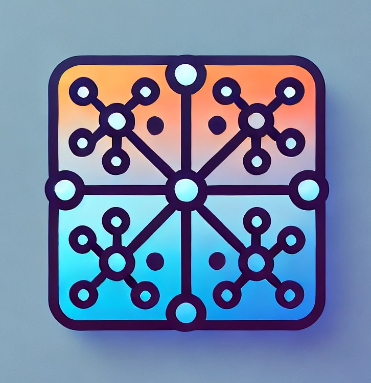
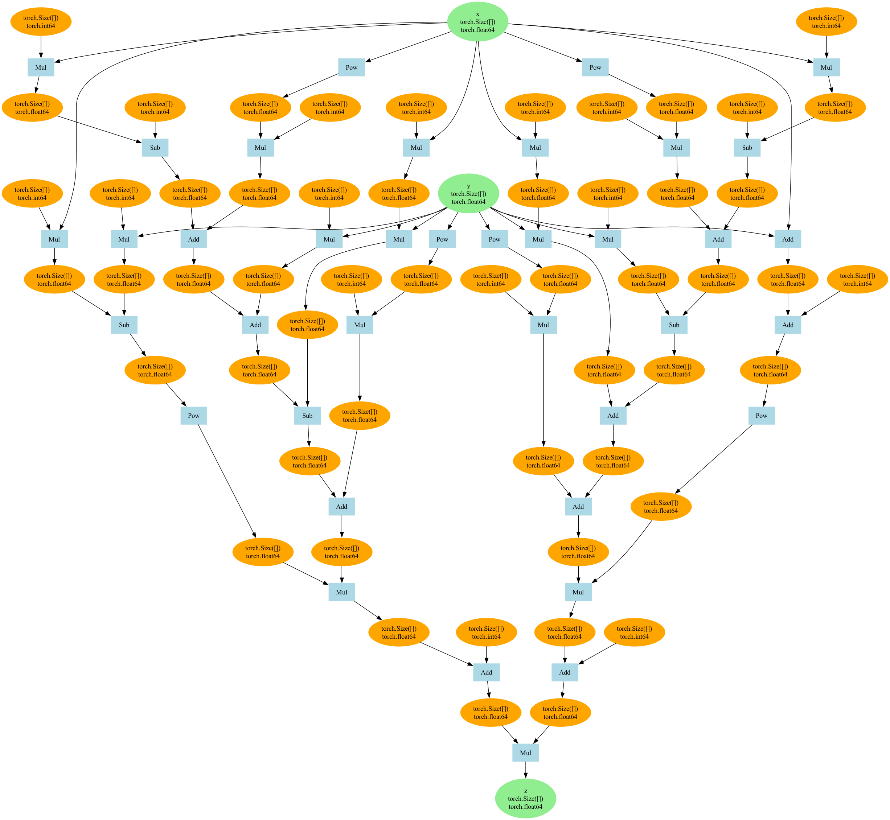

<p align="center">
  
</p>

<p align="center">
  <em>This is an educational implementation of GPT from scratch using numpy.</em>
</p>

<p align="center">
  
  
  
</p>

# Overview
- An educational implementation of GPT from scratch using numpy, heavily inspired by [deep-learning-from-scratch-3](https://github.com/oreilly-japan/deep-learning-from-scratch-3), [nanoGPT](https://github.com/karpathy/nanoGPT), and [pytorch](https://github.com/pytorch/pytorch).

# Concepts

## 1. Auto Differentiation
1. Auto Differentiation is a core algorithm for neural networks to compute backpropagation by following the chain rule.
2. To implement the chain rule, we need to satisfy the following requirements:
  - During forward propagation,
    1. A function gets input tensors and returns output tensors.
    2. The function should refer to the input tensors and output tensors.
    3. The output tensor should also refer to the function.
  - During backward propagation,
    1. The output tensor brings the function that generated the tensor.
    2. The function computes the gradient of the output tensor with respect to the input tensor.
    3. If the function has multiple input tensors, the function should accumulate the gradients of the input tensors.
3. To meet the requirements, we define the following concepts:
  - `Creator`
    - A function that generates a tensor.
    - When backpropagating, each output tensor refers to its `Creator` so that the creator can compute the gradient of the output tensor.
    ```mermaid
    graph LR
    Tensor1[Tensor] --> Function[Function]
    Function --> Tensor2[Tensor]

    Function -. "inputs" .-> Tensor1
    Function -. "outputs" .-> Tensor2
    Tensor2 -. "creator" .-> Function
    ```
  - `Generation`
    - Each node(tensor or function) has its generation that means the order of the node being created.
    - Being started from 0, the generation number is incremented when the node is created.
    - When backpropagating, the backward computations are performed in the reverse order of the generation number.
    - Why is it needed?
      - Gradients of each generation should be accumulated before being passed back to the function at younger generation.
      - E.g., in the following diagram, the `dy/da` is the sum of `dy/db * db/da` and `dy/dc * dc/da`.
      - But there's a risk that the node `a` passes them one by one, which makes backpropagation being performed twice.
      - To avoid this, we need to compute gradients of tensors at older generation first and accumulate the gradients of the tensors that were inputted to multiple functions.
    ```mermaid
    graph LR
      x((x @ 0)) --> Func1[Func1 @ 0]
      Func1 --> a((a @ 1))
      a --> Func2[Func2 @ 1]
      a --> Func3[Func3 @ 1]
      Func2 --> b((b @ 2))
      Func3 --> c((c @ 2))
      b --> Func4[Func4 @ 2]
      c --> Func4[Func4 @ 2]
      Func4 --> y((y @ 3))
    ```
4. Memory Optimization
  - As you can see the diagram at `Creator`, the function and the output refer to each other.(circular reference)
  - To avoid this, we use `weakref.ref` for the outputs of the function.
  - Using weakref.ref for output tensors eliminates circular references, reducing memory usage by 72% (from 136.4 MiB to 38.2 MiB) in our test([measure_memory.py](./torch/measure_memory.py)).

## 2. Define-by-Run vs. Define-and-Run

There are two fundamental paradigms for implementing automatic differentiation and building neural networks:

### 2.1. Define-and-Run

In the Define-and-Run paradigm, the entire computational graph is constructed before execution.

- The computational graph is fully defined, analyzed, and compiled before any data flows through it
- Once defined, the same graph processes all input data without changing its structure
- Examples: TensorFlow 1.x, Theano, Caffe

**Key characteristics:**
- Clear separation between graph definition and execution phases
- Graph optimization happens during compilation, improving performance
- Easier to deploy to production environments and non-Python platforms
- Well-suited for distributed computing across multiple devices
- More difficult to debug as errors often occur in the compiled graph
- Less flexible for dynamic computational patterns

### 2.2. Define-by-Run

In the Define-by-Run paradigm, the computational graph is constructed dynamically during execution.

- The computational graph is created on-the-fly as operations are performed
- Each forward pass can potentially create a different graph structure
- Examples: PyTorch, TensorFlow Eager mode, Chainer

**Key characteristics:**
- No separate compilation step; operations execute immediately
- More Pythonic approach, using native control flow statements
- Easier to debug as errors occur at the point of operation
- More intuitive development experience with standard Python tools
- Supports dynamic models where graph structure depends on input data
- May sacrifice some optimization opportunities available in static graphs

### 2.3. Summary

| Feature | Define-and-Run | Define-by-Run |
|---------|---------------|---------------|
| Graph Construction | Pre-compiled static graph | Dynamic graph built during execution |
| Programming Style | Domain-specific language | Native Python code |
| Debugging | Harder (debugging compiled graph) | Easier (standard Python debugging) |
| Performance | Potentially better (global optimization) | Potentially worse (less optimization) |
| Flexibility | Less flexible for dynamic patterns | More flexible for dynamic patterns |
| Deployment | Easier to deploy to production/devices | More dependent on Python runtime |
| Learning Curve | Steeper | More intuitive for Python developers |
| Use Cases | Production deployment, mobile/edge devices | Research, rapid prototyping |
| Examples | TensorFlow 1.x, Theano | PyTorch, TensorFlow Eager |

This implementation follows the Define-by-Run paradigm, similar to PyTorch.

# Features

## 1. Tensor Operations

This library implements a subset of PyTorch's tensor operations from scratch using NumPy as the underlying computation engine. All operations support automatic differentiation.

### 1.1. Supported Operations

- **Creation**: `torch.tensor()` - Create tensors from Python scalars, lists, or NumPy arrays
- **Arithmetic**: Addition (`+`), Subtraction (`-`), Multiplication (`*`), Division (`/`), Negation (`-`)
- **Mathematical**: `square()`, `exp()`, `pow()`

### 1.2. Autograd Support

```python
# Example of autograd
x = torch.tensor([2.0], requires_grad=True)
y = x**2 + 1  # Forward pass
y.backward()  # Backward pass
print(x.grad)  # Access gradients
```

### 1.3. Properties

- **Define-by-Run**: Computational graph is constructed dynamically during execution
- **Type Safety**: Only floating-point tensors can require gradients
- **No-grad Mode**: Context manager to disable gradient tracking during inference
- **Gradient Accumulation**: Support for complex computational graphs
- **Memory Optimization**: Uses weak references to avoid circular reference memory leaks

## 2. Neural Network Visualization

The library provides robust tools for visualizing computational graphs, which helps understand the flow of tensors through operations:

- Generate DOT representations of computational graphs
- Visualize graphs in multiple formats (PNG, SVG, PDF, etc.)
- Display tensor shapes, names, and data types
- Follow the computation chain backward from outputs to inputs

### 2.1. Requirements

- Graphviz must be installed on your system for generating image files
  - [Installation instructions](https://www.graphviz.org/download)
  - macOS: `brew install graphviz`
  - Ubuntu/Debian: `apt-get install graphviz`
  - Windows: Download installer from the Graphviz website

### 2.2. Basic Usage
- Code
  ```python
  import torch
  from torch.utils import plot_dot_graph
  from tests.torch.complex_funcs import goldstein

  x = torch.tensor(1.0, requires_grad=True, name="x")
  y = torch.tensor(1.0, requires_grad=True, name="y")
  z: torch.Tensor = goldstein(x, y)
  z.backward()

  x.name = "x"
  y.name = "y"
  z.name = "z"
  plot_dot_graph(z, "goldstein.png", verbose=True)
  ```
- Output
  


### 2.3. Details
- The visualization can be exported in any format supported by Graphviz:
  ```python
  # DOT file (raw graph definition)
  plot_dot_graph(z, "graph.dot", verbose=True)

  # Image formats
  plot_dot_graph(z, "graph.png", verbose=True)  # PNG
  plot_dot_graph(z, "graph.svg", verbose=True)  # SVG
  plot_dot_graph(z, "graph.pdf", verbose=True)  # PDF
  ```
- The `verbose` parameter controls the amount of information displayed:
  ```python
  # Minimal visualization (just the graph structure)
  plot_dot_graph(z, "minimal_graph.png", verbose=False)

  # Detailed visualization (with tensor names, shapes, and dtypes)
  plot_dot_graph(z, "detailed_graph.png", verbose=True)
- Understanding the Graph
  - **Orange nodes**: Tensor objects (inputs and intermediate values)
  - **Green nodes**: Named tensor objects (when verbose=True and tensor has a name)
  - **Blue boxes**: Operations (functions that transform tensors)
  - **Arrows**: Data flow direction between operations and tensors

# References
- [PyTorch Pocket Reference](https://www.oreilly.com/library/view/pytorch-pocket-reference/9781492089995)
- Paszke, Adam, et al. "Automatic differentiation ni pytorch." (2017). [link](https://openreview.net/pdf?id=BJJsrmfCZ)